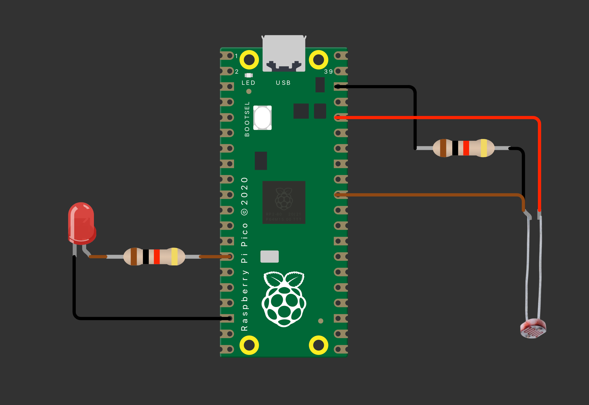
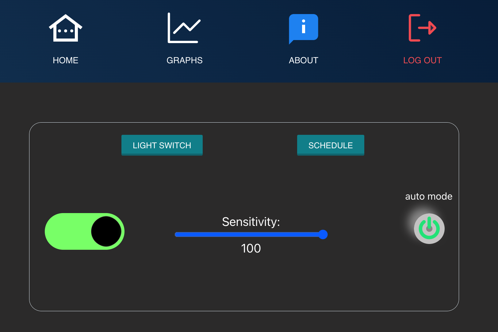
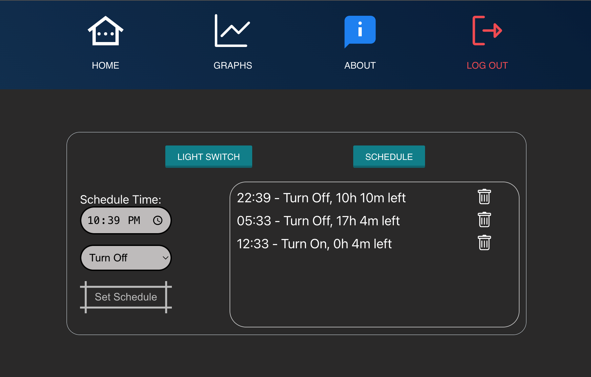
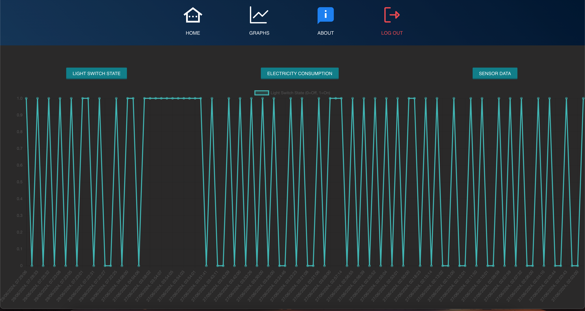
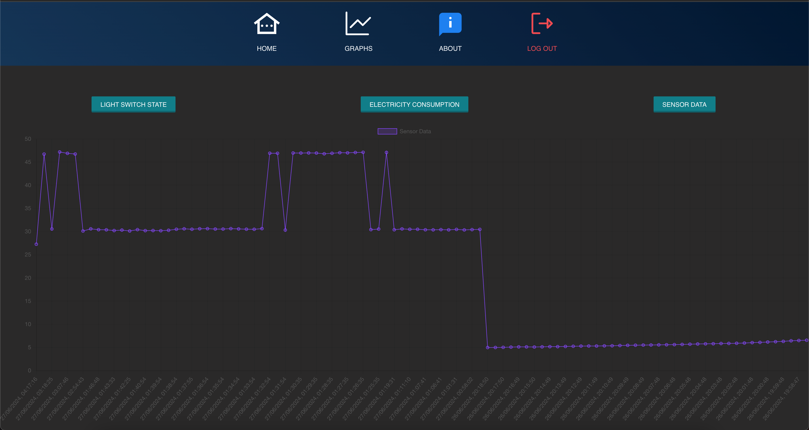
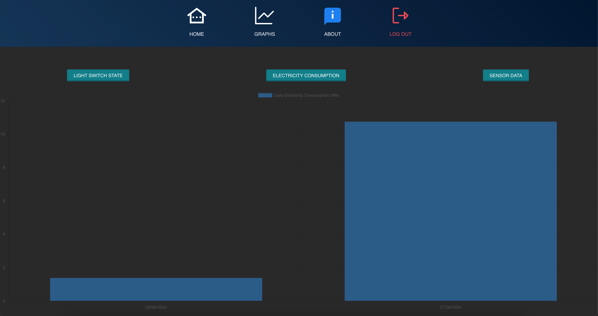
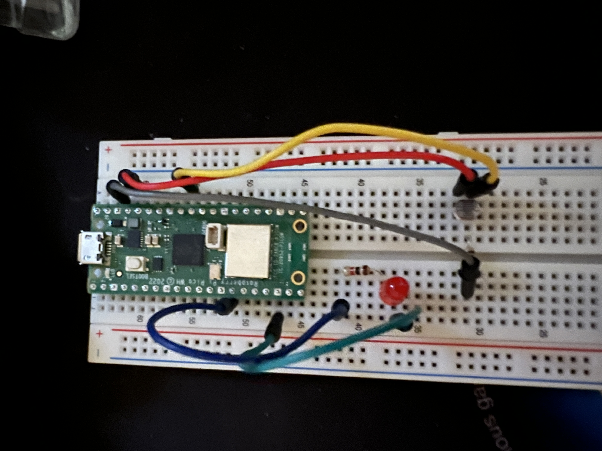

# Home Automation Project: LED Light Control

**Samuel Azzawi (sa224pt)**

## Project Overview

This project demonstrates a proof of concept for home automation by connecting an LED light to a Raspberry Pi Pico and creating a React website to control it. The React website interfaces with Firebase for user authentication and Adafruit for MQTT messaging to communicate with the Pico. Users can turn the light on or off, set it to auto mode based on ambient light levels, adjust sensor sensitivity, and schedule lighting times. Additionally, the website displays graphs for light data, energy consumption, and light switch states.

**Estimated Time to Complete**:

for the python code it takes about 1-2 hours max,
for the website it depends on how advanced you make it, so in average it takes about 5-20 hours including connecting it to Firebase and mqtt.
so overall it takes less than 24 hours to complete, so you can finish it in 1 day if you dont sleep :)

---

## Objective

### Why I Chose the Project

The purpose of this project is to explore the integration of IoT devices with web technologies to automate home lighting. By collecting and analyzing light data, this system can optimize energy consumption and improve user convenience.

### What Purpose Does It Serve

The project aims to automate lighting based on environmental conditions and user preferences, enhancing convenience and potentially reducing energy costs.

### What Insights It Will Give

This project provides insights into:
- The integration of IoT devices with web applications.
- The practical application of MQTT messaging for device communication.
- Energy consumption patterns based on light usage.

---

## Material

### List of Material

1. **Raspberry Pi Pico WH**  
   - **Description**: Microcontroller for running the automation code.  
   - **Cost**: 109 SEK  
   - **Source**: [Electrokit Sweden AB](https://www.electrokit.com/raspberry-pi-pico-wh/)

2. **LED Light**  
   - **Description**: Light source controlled by the Pico.  
   - **Cost**: 2.45 SEK  
   - **Source**: [Electrokit Sweden AB](https://www.electrokit.com/led-5mm-rod-flat-topp/)

3. **Light Sensor (e.g., LDR)**  
   - **Description**: Detects ambient light levels.  
   - **Cost**: 10 SEK  
   - **Source**: Local electronics store

4. **Breadboard and Jumper Wires**  
   - **Description**: For connecting components.  
   - **Cost**: 69 SEK  
   - **Source**: [Electrokit Sweden AB](https://www.electrokit.com/kopplingsdack-840-anslutningar/)

5. **Cables and Resistors**  
   - **Description**: To connect the components to pico.  
   - **Cost**: ~20 SEK  
   - **Source**: Local electronics store

6. **React Website**  
   - **Description**: Interface for controlling the light and viewing data.  
   - **Cost**: Free  
   - **Source**: Self-developed

7. **Firebase Account**  
   - **Description**: For user authentication.  
   - **Cost**: Free tier available  
   - **Source**: [Firebase](https://firebase.google.com/)

. **Adafruit IO Account**  
   - **Description**: For MQTT messaging.  
   - **Cost**: Free tier available  
   - **Source**: [Adafruit IO](https://io.adafruit.com/)

---

## Computer Setup

### Chosen IDE

**Visual Studio Code** with the following extensions:
- **MicroPico**: For programming the Raspberry Pi Pico with MicroPython.
- **Prettier**: For code formatting.

### How the Code is Uploaded

1. Install the **MicroPico** extension in Visual Studio Code.
2. Connect the Raspberry Pi Pico to your computer via USB.
3. Open the command palette in Visual Studio Code and select `Show and run commands > MicroPico-Connect`.
4. Write your MicroPython code and save the file as `main.py`.
5. save it to the pico .

### Steps for Computer Setup

1. Install [Node.js](https://nodejs.org/) for the React website.
2. Install [Visual Studio Code](https://code.visualstudio.com/).
3. Install the **Firebase CLI** using npm:  
   ```bash
   npm install -g firebase-tools
   ```
4. Set up a Firebase project in the [Firebase Console] by following the instructions on (https://console.firebase.google.com/).
5. Install dependencies for the React project:  
   ```bash
   npm install
   ```

---

## Putting Everything Together

### Circuit Diagram



### Electrical Calculations

- Ensure the LED operates within the Pico's voltage and current specifications.
- Use appropriate resistors to limit current through the LED.

---

## Platform

### Platform Choice

**Adafruit IO** for MQTT messaging and **Firebase** for user authentication.

### Local Installation vs. Cloud

- The platform is cloud-based using free tiers of Adafruit IO and Firebase and the website is hosted on Vercel.

### Functionality and Comparison

- **Adafruit IO**: Simple to use, good documentation, suitable for small projects.
- **Firebase**: Robust authentication and real-time database services.
- **Vercel**: free tier for personal use, easy to work with as you can update github and it will automatically update.

---

## The Code

### Core Functions

```python
def load_config(filename='config.txt'):
    config = {}
    with open(filename, 'r') as file:
        for line in file:
            if '=' in line:
                key, value = line.strip().split('=', 1)
                config[key] = value
    return config
```

### Explanation

- **`load_config`**: I decided to make a separate file and have all the configurations in it. This way the code can be more dynamic and the configuration data can be protected so the code would read from the config.txt.

```python
if entry["state"] == 1:
                    auto_mode = False
                    red.value(1)
                    mqtt_client.publish(mqtt_subscribe_automanual, '0')
                    mqtt_client.publish(mqtt_publish_lightswitchstate, '1')
                    mqtt_client.publish(mqtt_subscribe_lightswitch, '1')
                    current_light_switch_state = 1
                    print("Light turned ON as per schedule")
                    delete_data(key[0])
                    del key[0]
                    del timelist[0]
```
### Explanation

- Here we can see an example of a scheduled event being executed. The app switches the device to manual mode, ensuring that the sensor does not interfere with the scheduled operation. It then sends messages via MQTT to notify the system of the changes. The website receives these messages and updates the switches accordingly, and finally it deletes the scheduled event from it's memory.

---
## Transmitting the Data / Connectivity

### Data Transmission Overview
In this project, data is transmitted from the Raspberry Pi Pico to the internet using WiFi and MQTT. The MQTT credentials are stored in the Pico's configuration file, which it reads during initialization. Data transmission occurs every 60 seconds, but can also be triggered by user actions, such as switching the light on or off or changes detected by the light sensor.

### How the Data is Sent

1. **WiFi Connection**:
    ```python
    import network
    import utime

    # WiFi Configuration
    wifi_ssid = config.get('WIFI_SSID')
    wifi_password = config.get('WIFI_PASSWORD')

    # Connect to WiFi
    wlan = network.WLAN(network.STA_IF)
    wlan.active(True)
    wlan.connect(wifi_ssid, wifi_password)
    while not wlan.isconnected():
        print('Waiting for connection...')
        utime.sleep(1)
    print("Connected to WiFi")
    ```

2. **MQTT Configuration and Initialization**:
    ```python
    from umqtt.simple import MQTTClient

    # MQTT Configuration
    mqtt_host = config.get('MQTT_HOST')
    mqtt_username = config.get('MQTT_USERNAME')
    mqtt_password = config.get('MQTT_PASSWORD')
    mqtt_client_id = config.get('MQTT_CLIENT_ID')
    mqtt_publish_data = config.get('MQTT_PUBLISH_DATA')
    mqtt_publish_lightswitchstate = config.get('MQTT_PUBLISH_LIGHTSWITCHSTATE')
    mqtt_subscribe_lightswitch = config.get('MQTT_SUBSCRIBE_LIGHTSWITCH')
    mqtt_subscribe_automanual = config.get('MQTT_SUBSCRIBE_AUTOMANUAL')
    mqtt_subscribe_sensor = config.get('MQTT_SUBSCRIBE_SENSOR')

    # Initialize MQTT client
    mqtt_client = MQTTClient(client_id=mqtt_client_id, server=mqtt_host,
                             user=mqtt_username, password=mqtt_password)
    mqtt_client.connect()

    def on_message(topic, msg):
        print(f"Received message '{msg}' on topic '{topic}'")
        # Add message handling logic here

    mqtt_client.set_callback(on_message)
    mqtt_client.subscribe(mqtt_subscribe_lightswitch)
    mqtt_client.subscribe(mqtt_subscribe_automanual)
    mqtt_client.subscribe(mqtt_subscribe_sensor)
    ```

3. **Sending Data via MQTT**:
    ```python
    import time

    # Function to send light sensor data
    def publish_sensor_data():
        light = read_light()  # Function to read light sensor value
        mqtt_client.publish(mqtt_publish_data, str(light))
        print(f"Published light sensor data: {light}")

    # Periodic data transmission
    while True:
        publish_sensor_data()
        time.sleep(60)
    ```

### Wireless Protocols

- **WiFi**: Chosen for its availability and ease of setup in a home environment. WiFi provides sufficient range and bandwidth for this project.
- **MQTT**: Selected for its efficiency and low bandwidth usage, making it ideal for sending small packets of data frequently.

### Transport Protocols

- **MQTT**: Used for reliable, low-latency communication between the Pico and the server. It supports persistent sessions and ensures that messages are delivered even over unreliable networks.

### Frequency of Data Transmission

- **Regular Intervals**: Data is sent every 60 seconds.
- **Event-Driven**: Additional messages are sent when a user interacts with the system (e.g., toggling the light switch) or when the light sensor detects significant changes.

### Design Choices

- **WiFi**: Provides a good balance between range and data throughput for a home automation system. While it consumes more power than some other protocols (like LoRa), the Pico is assumed to be connected to a power source, making power consumption less of an issue.
- **MQTT**: Its lightweight nature reduces the amount of data transmitted, conserving bandwidth and making it efficient for the frequent transmission of small messages.

These choices ensure reliable and efficient communication within the home environment, providing real-time control and monitoring of the lighting system without significant power consumption concerns.


---

## Presenting the Data

### Dashboard

The React website provides a user interface to control the LED, set auto mode, adjust sensor sensitivity, and schedule lighting. It also displays graphs for light data, energy consumption, and light switch states.






### Data Storage

- **Database**: the data is stored in adafruit and lasts about a month, it is not ideal in a real project but as a proof of concept project and because there is no need to store the data longer, it was used.
- **Frequency of Data Saving**: Every time data comes to mqtt it gets saved.
- **Automation/triggers of the data**: the data is sent both automatically and manually, as the device will send the sensor data once a minute and can send other data if needed, for example the schedule can trigger other data to be sent, and when the user interact with the website data can be sent from both the website and the device.

---

## Finalizing the Design

### Final Results

The home automation system successfully allows users to control an LED light via a web interface, based on real-time sensor data.

### Final Thoughts

The project was a success, demonstrating the integration of hardware and web technologies. Future improvements could include additional sensors and more complex automation rules.

---

and with this simple setup I was able to control the light in so many different ways!

 
